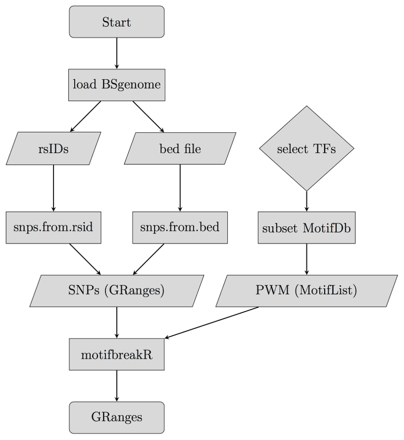
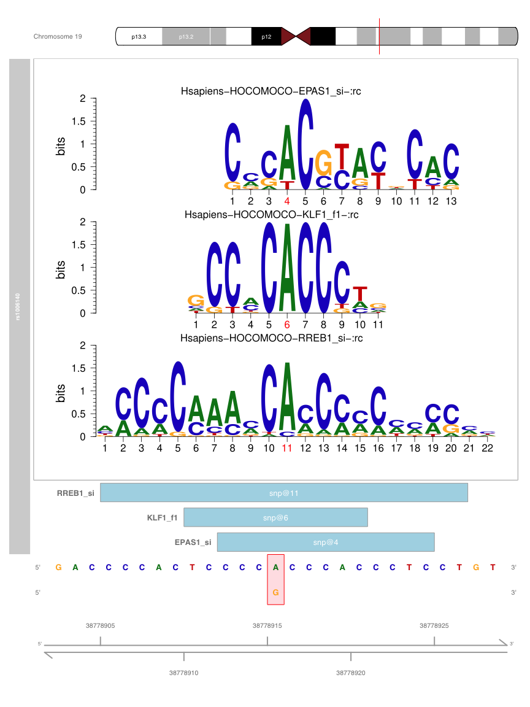

<!-- see http://rmarkdown.rstudio.com/ for details in formatting -->
```{r style, echo = FALSE, results='hide', message=FALSE, warning=FALSE}
BiocStyle::markdown()
options(width=100)
knitr::opts_chunk$set(cache=TRUE, autodep=TRUE)
```
# Introduction
This document offers an introduction and overview of `r BiocStyle::Biocpkg("motifbreakR")`, which allows the biologist to judge whether the sequence surrounding a polymorphism or mutation is a good match to known transcription factor binding sites, and how much information is gained or lost in one allele of the polymorphism relative to another or mutation vs. wildtype. `r BiocStyle::Biocpkg("motifbreakR")` is flexible, giving a choice of algorithms for interrogation of genomes with motifs from public sources that users can choose from; these are 1) a weighted-sum, 2) log-probabilities, and 3) relative entropy. `r BiocStyle::Biocpkg("motifbreakR")` can predict effects for novel or previously described variants in public databases, making it suitable for tasks beyond the scope of its original design. Lastly, it can be used to interrogate any genome curated within Bioconductor.

As of version 2.0 `r BiocStyle::Biocpkg("motifbreakR")` is also able to perform it's analysis on indels, small insertions or deletions.

`r BiocStyle::Biocpkg("motifbreakR")` works with position probability matrices (PPM). PPM are derived as the fractional occurrence of nucleotides A,C,G, and T at each position of a position frequency matrix (PFM). PFM are simply the tally of each nucleotide at each position across a set of aligned sequences. With a PPM, one can generate probabilities based on the genome, or more practically, create any number of position specific scoring matrices (PSSM) based on the principle that the PPM contains information about the likelihood of observing a particular nucleotide at a particular position of a true transcription factor binding site.

This guide includes a brief overview of the [processing flow](#flow), an example focusing more in depth on the [practical](#practical) aspect of using `r BiocStyle::Biocpkg("motifbreakR")`, and finally a detailed section on the [scoring methods](#methods) employed by the package.

# Processing overview {#flow}
`r BiocStyle::Biocpkg("motifbreakR")` may be used to interrogate SNPs or SNVs for their potential effect on transcription factor binding by examining how the two alleles of the variant effect the binding score of a motif.  The basic process is outlined in the figure below.

## Outline of process

<!-- this is here in order to import a figure and to add a caption -->
<div class="figure" style="text-align: center">
  
  <p class="caption"><em>motifbreakR workflow: How inputs (trapezoids) are generated from R functions (rectangles). Diamonds represent decisions of the user.</em></p>
</div>
This straightforward process allows the interrogation of SNPs and SNVs in the context of the different species represented by `r Biocpkg("BSgenome")` packages (at least 22 different species) and allows the use of the full `r Biocpkg("MotifDb")` data set that includes over 4200 motifs across 8 studies and 22 organisms that we have supplemented with over 2800 additional motifs across four additional studies in Humans see `data(encodemotif)`[^encodemotif], `data(factorbook)`[^factorbook], `data(hocomoco)`[^hocomoco] and `data(homer)`[^homer] for the additional studies that we have included.

[^encodemotif]: Website: [encode-motifs](http://compbio.mit.edu/encode-motifs/)
  Paper: [Systematic discovery and characterization of regulatory motifs in ENCODE TF binding experiments](http://dx.doi.org/10.1093/nar/gkt1249)
[^factorbook]: Website: [Factorbook](http://factorbook.org/mediawiki/index.php/Welcome_to_factorbook)
  Paper: [Sequence features and chromatin structure around the genomic regions bound by 119 human transcription factors](http://dx.doi.org/10.1101/gr.139105.112)
[^hocomoco]: Website: [HOCOMOCO](http://autosome.ru/HOCOMOCO/)
  Paper: [HOCOMOCO: a comprehensive collection of human transcription factor binding sites models](http://dx.doi.org/10.1093/nar/gks1089)
[^homer]: Website: [Homer](http://homer.salk.edu/homer/index.html)
  Paper: [http://www.sciencedirect.com/science/article/pii/S1097276510003667](http://dx.doi.org/10.1016/j.molcel.2010.05.004)

Practically `r BiocStyle::Biocpkg("motifbreakR")` has involves three phases.

1. *Read in Single Nucleotide Variants or Indels:* The first step is to read in the list of variants.  Variants can be a list of rsIDs if your SNPs are represented in one of the SNPlocs packages, may be included as a [.bed](http://www.genome.ucsc.edu/FAQ/FAQformat.html#format1) file with a specifically formatted name field, or may be provided as a [.vcf](http://www.1000genomes.org/wiki/analysis/variant%20call%20format/vcf-variant-call-format-version-41) file. We then transform these input such that it may be read my `r BiocStyle::Biocpkg("motifbreakR")`.
2. *Find Broken Motifs:* Next we present `r BiocStyle::Biocpkg("motifbreakR")` with the input generated in the previous step, along with a set of motifs formatted as class `MotifList`, and your preferred [scoring method](#methods). 
3. *Visualize SNPs and motifs:* Finally we can visualize which motifs are broken by any individual SNP using our plotting function.

# How To Use motifbreakR: A Practical Example {#practical}
This section offers an example of how to use `r BiocStyle::Biocpkg("motifbreakR")` to identify potentially disrupted transcription factor binding sites due to 701 SNPs output from a `r Biocpkg("FunciSNP")` analysis of Prostate Cancer (PCa) genome wide association studies (GWAS) risk loci.
The SNPs are included in this package here:
```{r start, cache=TRUE, message=FALSE}
library(motifbreakR)
pca.snps.file <- system.file("extdata", "pca.enhancer.snps", package = "motifbreakR")
pca.snps <- as.character(read.table(pca.snps.file)[,1])
```
The simplest form of a `r BiocStyle::Biocpkg("motifbreakR")` analysis is summarized as follows:
```{r outline, eval=FALSE}
variants <- snps.from.rsid(rsid = pca.snps,
                           dbSNP = SNPlocs.Hsapiens.dbSNP155.GRCh37,
                           search.genome = BSgenome.Hsapiens.UCSC.hg19)
motifbreakr.results <- motifbreakR(snpList = variants, pwmList = MotifDb, threshold = 0.9)
plotMB(results = motifbreakr.results, rsid = "rs7837328", effect = "strong")
```
Lets look at these steps more closely and see how we can customize our analysis.

## *Step 1* | Read in Single Nucleotide Variants

Variants can be input either as a list of rsIDs or as a [.bed](http://www.genome.ucsc.edu/FAQ/FAQformat.html#format1) file. The main factor determining which you will use is if your variants have rsIDs that are included in one of the Bioconductor `SNPlocs` packages.  The present selection is seen here:
```{r whichsnps, message=FALSE, cache=TRUE}
library(BSgenome)
available.SNPs()
```
For cases where your rsIDs are not available in a SNPlocs package, or you have novel variants that are not cataloged at all, variants may be entered in [BED](http://www.genome.ucsc.edu/FAQ/FAQformat.html#format1) format as seen below:
```{r showbed, message=FALSE, cache=TRUE}
snps.file <- system.file("extdata", "snps.bed", package = "motifbreakR")
read.delim(snps.file, header = FALSE)
```
Our requirements for the BED file are that it must include `chromosome`, `start`, `end`, `name`, `score` and `strand` fields -- where the name field is required to be in one of two formats, either an rsID that is present in a SNPlocs package, or in the form `chromosome:position:referenceAllele:alternateAllele` e.g., `chr2:12594018:G:A`.  It is also essential that the fields are TAB separated, not a mixture of tabs and spaces.

More to the point here are the two methods for reading in the variants.

### SNPs from rsID:


We use the `r Biocannopkg("SNPlocs.Hsapiens.dbSNP155.GRCh37")` which is the SNP locations and alleles defined in [dbSNP155](http://www.ncbi.nlm.nih.gov/projects/SNP/snp_summary.cgi?view+summary=view+summary&build_id=155) as a source for looking up our rsIDs and `r Biocannopkg("BSgenome.Hsapiens.UCSC.hg19")` which holds the reference sequence for [UCSC genome build hg19](http://www.ncbi.nlm.nih.gov/assembly/2758/). Additional SNPlocs packages are availble from Bioconductor.

```{r fromrsid, message=FALSE, cache=TRUE}
library(SNPlocs.Hsapiens.dbSNP155.GRCh37) # dbSNP155 in hg19
library(BSgenome.Hsapiens.UCSC.hg19)     # hg19 genome
head(pca.snps)
snps.mb <- snps.from.rsid(rsid = pca.snps,
                          dbSNP = SNPlocs.Hsapiens.dbSNP155.GRCh37,
                          search.genome = BSgenome.Hsapiens.UCSC.hg19)
snps.mb
```

A far greater variety of variants may be read into `r BiocStyle::Biocpkg("motifbreakR")` via the `snps.from.file` function. In fact `r BiocStyle::Biocpkg("motifbreakR")` will work with any organism present as a Bioconductor `r Biocpkg("BSgenome")` package. This includes 76 genomes representing 22 species.

```{r whichgenome, message=FALSE, cache=TRUE}
library(BSgenome)
genomes <- available.genomes()
length(genomes)
genomes
```

### SNPs from BED formatted file:
Here we examine two possibilities. In one case we have a mixture of rsIDs and our naming scheme that allows for arbitrary variants.  Second we have a list of variants for the zebrafish *Danio rerio* that does not have a `SNPlocs` package, but does have it's genome present among the `availible.genomes()`.

```{r showbed2, message=TRUE, cache=TRUE}
snps.bed.file <- system.file("extdata", "snps.bed", package = "motifbreakR")
# see the contents
read.table(snps.bed.file, header = FALSE)
```
Seeing as we have some SNPs listed by their rsIDs we can query those by including a SNPlocs object as an argument to `snps.from.file`
```{r getbedrs, message=FALSE, echo = TRUE, eval = FALSE}
library(SNPlocs.Hsapiens.dbSNP155.GRCh37)
#import the BED file
snps.mb.frombed <- snps.from.file(file = snps.bed.file,
                                  dbSNP = SNPlocs.Hsapiens.dbSNP155.GRCh37,
                                  search.genome = BSgenome.Hsapiens.UCSC.hg19,
                                  format = "bed", check.unnamed.for.rsid = TRUE)
snps.mb.frombed
```
```{r getbedrs.t, message=TRUE, echo = FALSE, eval = TRUE, cache=TRUE}
library(SNPlocs.Hsapiens.dbSNP155.GRCh37)
example.snpfrombed <- system.file("extdata", "example.snpfrombed.rda", package = "motifbreakR")
load(example.snpfrombed)
message("Warning in snps.from.file(file = snps.bed.file, dbSNP = SNPlocs.Hsapiens.dbSNP155.GRCh37,  :
  rs7601289 was found as a match for chr2:12594018:G:A; using entry from dbSNP
  rs11753604 was found as a match for chr6:44503246:A:T; using entry from dbSNP")
snps.mb.frombed
```
We see also that two of our custom variants `chr2:12594018:G:A` and `chr6:44503246:A:T` were actually already included in dbSNP155, and were therefor annotated in the output as `rs7601289` and `rs11753604` respectively.

If our BED file includes no rsIDs, then we may omit the `dbSNP` argument from the function. This example uses variants from *Danio rerio*
```{r getbedcust, message=FALSE, cache=TRUE}
library(BSgenome.Drerio.UCSC.danRer7)
snps.bedfile.nors <- system.file("extdata", "danRer.bed", package = "motifbreakR")
read.table(snps.bedfile.nors, header = FALSE)
snps.mb.frombed <- snps.from.file(file = snps.bedfile.nors,
                                  search.genome = BSgenome.Drerio.UCSC.danRer7,
                                  format = "bed")
snps.mb.frombed
```

`snps.from.file` also can take as input a vcf file with SNVs, by using `format = "vcf"`.

### Indels

As of version 2.0 `r BiocStyle::Biocpkg("motifbreakR")` is able to parse and analyse indels as well as SNVs. The function `variants.from.file()` allows the import of indels and SNVs simultaneously.

```{r getindel, message=FALSE, cache=TRUE}
snps.indel.vcf <- system.file("extdata", "chek2.vcf.gz", package = "motifbreakR")
snps.indel <- variants.from.file(file = snps.indel.vcf, 
                                 search.genome = BSgenome.Hsapiens.UCSC.hg19, 
                                 format = "vcf")
snps.indel
```

We can filter to specifically see the indels like this:

```{r showindel, message=FALSE, cache=TRUE}
snps.indel[nchar(snps.indel$REF) > 1 | nchar(snps.indel$ALT) > 1]
```

## *Step 2* | Find Broken Motifs
Now that we have our data in the required format, we may continue to the task at hand, and determine which variants modify potential transcription factor binding. An important element of this task is identifying a set of transcription factor binding motifs that we wish to query. Fortunately `r Biocpkg("MotifDb")` includes a large selection of motifs across multiple species that we can see here:
```{r motifdb, message=FALSE, cache=TRUE}
library(MotifDb)
MotifDb
```
```{r motifdbtableshow, message=FALSE, cache=TRUE, eval=FALSE}
### Here we can see which organisms are availible under which sources
### in MotifDb
table(mcols(MotifDb)$organism, mcols(MotifDb)$dataSource)
```
```{r motifdbtableres, message=FALSE, cache=TRUE, echo=FALSE}
knitr::kable(table(mcols(MotifDb)$organism, mcols(MotifDb)$dataSource), format = "html", table.attr="class=\"table table-striped table-hover\"")
```

We have leveraged the `MotifList` introduced by `r Biocpkg("MotifDb")` to include an additional set of motifs that have been gathered to this package:
```{r motifbreakrmot, message=FALSE, cache=TRUE}
data(motifbreakR_motif)
motifbreakR_motif
```
The different studies included in this data set may be called individually; for example:
```{r hocomocomot, message=FALSE, cache=TRUE}
data(hocomoco)
hocomoco
```
See `?motifbreakR_motif` for more information and citations.


Some of our data sets include a sequenceCount. These include `FlyFactorSurvey`, `hPDI`, `JASPAR_2014`, `JASPAR_CORE`, and `jolma2013` from `r Biocpkg("MotifDb")` and `HOCOMOCO` from the set of `motifbreakR_motif`. Using these we calculate a pseudocount to allow us to calculate the logarithms in the case where we have a `0` in a pwm.  The calculation for incorporating pseudocounts is `ppm <- (ppm * sequenceCount + 0.25)/(sequenceCount + 1)`.  If the sequenceCount for a particular ppm is `NA` we use 20 as a default sequenceCount.

Now that we have the three necessary components to run `r BiocStyle::Biocpkg("motifbreakR")`:

1. A `BSgenome` object for our organism, in this case `BSgenome.Hsapiens.UCSC.hg19`
2. A `MotifList` object containing our motifs, in this case `hocomoco`,
3. And our input `GRanges` object generated by `snps.from.rsid`, in this case `snps.mb`

We get to the task of actually running the function `motifbreakR()`.

We have several options that we may pass to the function, the main ones that will dictate how long the function will run with a given set of variants and motifs are the `threshold` we pass and the `method` we use to [score](#methods).

Here we specify the `snpList`, `pwmList`, `threshold` that we declare as the cutoff for reporting results, `filterp` set to true declares that we are filtering by p-value, the `method`, and `bkg` the relative nucleotide frequency of A, C, G, and T.

For the purposes of this small example, we use the `SerialParam` back end. However, for larger variant lists, `MulticoreParam` or one of the other `r Biocpkg("BiocParallel")` back-ends could speed up completion.

```{r runmotifbreakr, message=TRUE, cache=TRUE}
results <- motifbreakR(snpList = snps.mb[1:12], filterp = TRUE,
                       pwmList = subset(MotifDb, 
                                        dataSource %in% c("HOCOMOCOv11-core-A", "HOCOMOCOv11-core-B", "HOCOMOCOv11-core-C")),
                       threshold = 1e-4,
                       method = "ic",
                       bkg = c(A=0.25, C=0.25, G=0.25, T=0.25),
                       BPPARAM = BiocParallel::SerialParam())
```
The results reveal which variants disrupt which motifs, and to which degree.  If we want to examine a single variant, we can select one like this:
```{r getonesnp, cache=TRUE}
rs1006140 <- results[results$SNP_id == "rs1006140"]
rs1006140
```
Here we can see that SNP rs1006140 disrupts multiple motifs. We can then check what the pvalue for each allele is with regard to each motif, using `calculatePvalue`.
```{r calcp.show, eval=FALSE}
rs1006140 <- calculatePvalue(rs1006140, granularity = 1e-6)
rs1006140
```
```{r calcp, cache=TRUE, echo=FALSE}
example.p <- system.file("extdata", "example.pvalue.rda", package = "motifbreakR")
load(example.p)
rs1006140
```
And here we see that for each SNP we have at least one allele achieving a p-value below 1e-4 threshold that we required. The `seqMatch` column shows what the reference genome sequence is at that location, with the variant position appearing in an uppercase letter. pctRef and pctAlt display the the score for the motif in the sequence as a percentage of the best score that motif could achieve on an ideal sequence. In other words $(scoreVariant-minscorePWM)/(maxscorePWM-minscorePWM)$. We can also see the absolute scores for our method in scoreRef and scoreAlt and thier respective p-values.

### Parallel Evaluation (an aside)
Important to note, is that `motifbreakR` uses the `r Biocpkg("BiocParallel")` parallel back-end, and one may modify what type of parallel evaluation it uses (or if it runs in parallel at all).  Here we can see the versions available on the machine this vignette was compiled on.
```{r aboutparallel, message=TRUE, cache=TRUE}
BiocParallel::registered()
BiocParallel::bpparam()
```
By default `motifbreakR` uses `bpparam()` as an argument to `BPPARAM` and will use all available cores on the machine on which it is running. However on Windows machines this reverts to using a serial evaluation model, so if you wish to run in parallel on a Windows machine consider using a different parameter shown in `BiocParallel::registered()` such as `SnowParam` passing `BPPARAM = SnowParam()`.

## *Step 3* | Visualize
Now that we have our results, we can visualize them with the function `plotMB`.  Lets take a look at rs1006140.
```{r plotting, cache=TRUE, fig.retina=2, fig.align='center', fig.height=8, fig.width=6}
plotMB(results = results, rsid = "rs1006140", effect = "strong", altAllele = "G")
plotMB(results = results, rsid = "rs1006140", effect = "strong", altAllele = "C")
```
<!-- <div class="figure" style="text-align: center"> -->
<!--    -->
<!-- </div> -->

# Methods {#methods}
`r BiocStyle::Biocpkg("motifbreakR")` works with position probability matrices (PPM). PPM
are derived as the fractional occurrence of nucleotides A,C,G, and T at
each position of a position frequency matrix (PFM). PFM are simply the
tally of each nucleotide at each position across a set of aligned
sequences. With a PPM, one can generate probabilities based on the
genome, or more practically, create any number of position specific
scoring matrices (PSSM) based on the principle that the PPM contains
information about the likelihood of observing a particular nucleotide at
a particular position of a true transcription factor binding site. What
follows is a discussion of the three different algorithms that may be
employed in calls to the `r BiocStyle::Biocpkg("motifbreakR")` function via the `method`
argument.

Suppose we have a frequency matrix $M$ of width $n$ (*i.e.* a
PPM as described above). Furthermore, we have a sequence $s$ also of
length $n$, such that
$s_{i} \in \{ A,T,C,G \}, i = 1,\ldots n$. Each column of
$M$ contains the frequencies of each letter in each position.

Commonly in the literature sequences are scored as the sum of log
probabilities:

## Sum of Log Probabilities {#eqn1}
$$F( s,M ) = \sum_{i = 1}^{n}{\log( \frac{M_{s_{i},i}}{b_{s_{i}}} )}$$

where $b_{s_{i}}$ is the background frequency of letter $s_{i}$ in
the genome of interest. This method can be specified by the user as
`method='log'`.

As an alternative to this method, we introduced a scoring method to
directly weight the score by the importance of the position within the
match sequence. This method of weighting is accessed by specifying
`method='default'` (weighted sum). A general representation
of this scoring method is given by:

## Weighted Sum
$$F( s,M ) = p( s ) \cdot \omega_{M}$$

where $p_{s}$ is the scoring vector derived from sequence $s$ and matrix
$M$, and $w_{M}$ is a weight vector derived from $M$. First, we
compute the scoring vector of position scores $p$:

## Calculating Scoring Vector $p$
$$p( s ) = ( M_{s_{i},i} ) \textrm{   where   } \frac{i = 1,\ldots n}{s_{i} \in \{ A,C,G,T \}}$$

and second, for each $M$ a constant vector of weights
$\omega_{M} = ( \omega_{1},\omega_{2},\ldots,\omega_{n} )$.

There are two methods for producing $\omega_{M}$. The first, which we
call weighted sum, is the difference in the probabilities for the two
letters of the polymorphism (or variant), *i.e.*
$\Delta p_{s_{i}}$, or the difference of the maximum and minimum
values for each column of $M$:

## Calculating $\omega$ For Weighted Sum {#eqn4.1}
$$\omega_{i} = \max \{ M_{i} \} - \min \{ M_{i} \}\textrm{    where      }i = 1,\ldots n$$

The second variation of this theme is to weight by relative entropy.
Thus the relative entropy weight for each column $i$ of the matrix is
given by:

## Calculating $\omega$ For Relative Entropy {#eqn4.2}
$$\omega_{i} = \sum_{j \in \{ A,C,G,T \}}^{}{M_{j,i}\log_2( \frac{M_{j,i}}{b_{i}} )}\textrm{     where     }i = 1,\ldots n$$

where $b_{i}$ is again the background frequency of the letter $i$.

Thus, there are 3 possible algorithms to apply via the `method`
argument. The first is the standard summation of log probabilities
(`method='log'`). The second and third are the weighted sum and
information content methods (`method='default'` and `method='ic'`) specified by
equations for [Weighted Sum](#eqn4.1) and [Relative Entropy](#eqn4.2), respectively. `r BiocStyle::Biocpkg("motifbreakR")` assumes a
uniform background nucleotide distribution ($b$) in equations [4.1](#eqn1) and
[4.5](#eqn4.1) unless otherwise specified by the user. Since we are primarily
interested in the difference between alleles, background frequency is
not a major factor, although it can change the results. Additionally,
inclusion of background frequency introduces potential bias when
collections of motifs are employed, since motifs are themselves
unbalanced with respect to nucleotide composition. With these cautions
in mind, users may override the uniform distribution if so desired. For
all three methods, `r BiocStyle::Biocpkg("motifbreakR")` scores and reports the reference
and alternate alleles of the sequence
($F( s_{\textrm{REF}},M )$ and
$F( s_{\textrm{ALT}},M )$), and provides the matrix scores
$p_{s_{\textrm{REF}}}$ and $p_{s_{\textrm{ALT}}}$ of the SNP (or
variant). The scores are scaled as a fraction of scoring range 0-1 of
the motif matrix, $M$. If either of
$F( s_{\textrm{REF}},M )$ and
$F( s_{\textrm{ALT}},M )$ is greater than a user-specified
threshold (default value of 0.85) the SNP is reported. By default
`r BiocStyle::Biocpkg("motifbreakR")` does not display neutral effects,
($\Delta p_{i} < 0.4$) but this behaviour can be
overridden.

## Calculate P-values for PWM match
Additionally, now, with the use of `r CRANpkg("TFMPvalue")`, we may filter by p-value of the match.
This is unfortunately a two step process. First, by invoking `filterp=TRUE` and setting a threshold at
a desired p-value e.g 1e-4, we perform a rough filter on the results by rounding all values in the PWM to two
decimal place, and calculating a scoring threshold based upon that. The second step is to use the function `calculatePvalue()`
on a selection of results which will change the `Refpvalue` and `Altpvalue` columns in the output from `NA` to the p-value
calculated by `TFMsc2pv`.  This can be (although not always) a very memory and time intensive process if the algorithm doesn't converge rapidly.

P-values can also be calculated in parallel, it is highly recommended to round the PWM matrix with the granularity argument. This trades the accuracy of the p-value calculation for speed of convergence. For most purposes a range of 1e-4 to 1e-6 is an acceptable trade off between accuracy and speed.

# Session Info
```{r, cache=TRUE}
sessionInfo()
```
